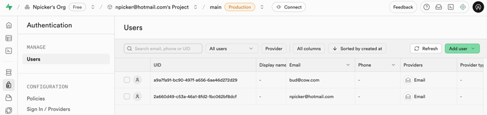

# Supabase Fun

This is a really nice service. You should be able to use this for small projects and not need a backend at all. It handles:

- Authentication
- Database
- File storage
- Database change notification
- WebSocket server passthrough

## Account

Easy to [create](https://supabase.com/) an account

- Unlimited API requests
- 50,000 monthly active users
- 500 MB database size
- Shared CPU • 500 MB RAM
- 500k edge requests
- 5 GB bandwidth
- 1 GB file storage
- Community support

## Overview

1. Create a simple database
1. Create the RLS policy
1. Get the account URL and ANON key
1. Create a user authentication
1. Create an edge function

## Database


## Security

1. Create a user. You can then authenticate with that email and password from your code.

   

   ```ts
   const r = await supabase.auth.signInWithPassword({
     email,
     password,
   });
   ```

1. Create RLS (row level security). Usually to you do this on an authenticated user. Basically this adds a user UUID column to your database that you can use in the policy to restrict who can act on it.

   

   ```sql
   alter policy "read"
   on "public"."food"
   to public
   using (
     (( SELECT auth.uid() AS uid) = user_id)
   );
   ```

## Edge functions

These are TS files that allow you to write functions that can add business logic to your access. See the [Example edge function](edge.ts)


## Sync

Great support for different sync models based on data changes, events, or user presence.

### Database change

```ts
import { createClient } from '@supabase/supabase-js';

const supabaseClient = createClient('URL', 'ANON');
const channel = supabaseClient
  .channel('postgresChangesChannel')
  .on(
    'postgres_changes',
    {
      event: 'INSERT',
      schema: 'public',
      table: 'messages',
    },
    (payload) => console.log(payload)
  )
  .subscribe();
```

### Broadcast

```ts
import { createClient } from '@supabase/supabase-js';

const supabaseClient = createClient('URL', 'ANON');
const channel = supabaseClient.channel('broadcastChannel', { configs: { broadcast: { self: true, ack: true } } });

channel
  .on('broadcast', { event: 'pos' }, (payload) => console.log(payload))
  .subscribe((status) => {
    if (status === 'SUBSCRIBED') {
      channel.send({ type: 'broadcast', event: 'pos', payload: { x: 0, y: 0 } }).then((status) => {
        if (status === 'ok') console.log('ok');

        // if ack is false then channel.send will always return 'ok'
        if (status === 'timed out') console.log('timed out');
      });
    }
  });
```

### Presence

```ts
import { createClient } from '@supabase/supabase-js';

const supabaseClient = createClient('URL', 'ANON');
const channel = supabaseClient.channel('presenceChannel', { configs: { presence: 'id123' } });

channel
  .on('presence', { event: 'sync' }, () => console.log(channel.presenceState()))
  .on('presence', { event: 'join' }, ({ key, currentPresences, newPresences }) => console.log(key, currentPresences, newPresences))
  .on('presence', { event: 'leave' }, ({ key, currentPresences, leftPresences }) => console.log(key, currentPresences, leftPresences))
  .subscribe((status) => {
    if (status === 'SUBSCRIBED') {
      channel.track({ user_name: 'user123' });
      channel.track({ user_name: 'user345' });
    }
  });
```
